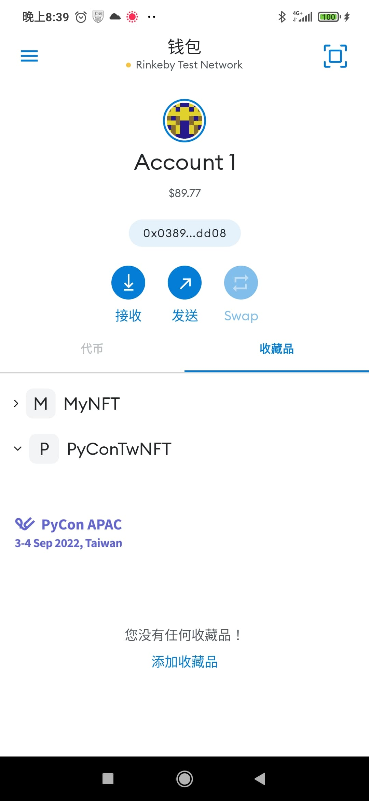

# NFT Playground

## Run

1. `npx hardhat compile`
2. `npx hardhat --network rinkeby run scripts/deploy.js`
3. `node scripts/mint-nft.js`
4. `node scripts/updateNFT.js`
## Tutorial

Follow this Etheruem tutorial then you can mint your own NFT

https://ethereum.org/en/developers/tutorials/how-to-write-and-deploy-an-nft/

## Demo

